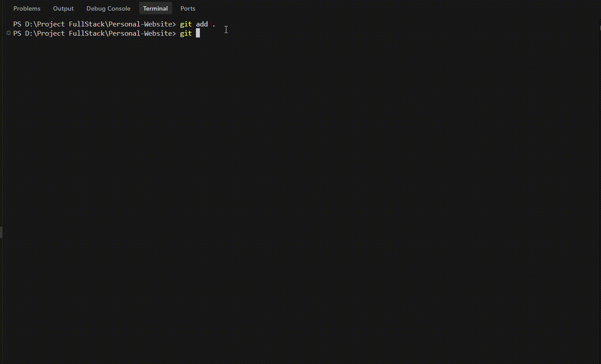

# 🤖 git-smart-commit

[](https://github.com/IchwanArdi/git-smart-commit/releases)
[](https://go.dev/)
[](LICENSE)
[](https://github.com/IchwanArdi/git-smart-commit/pulls)

**git-smart-commit** is a lightweight, open-source AI-powered CLI tool written in Go. It automatically analyzes your staged Git changes using Google Gemini AI (`gemini-3.5-flash`) and generates structured, high-quality **Conventional Commit** messages with optional one-click remote push.

---

## 🎬 Demo



---

## ✨ Features

- 🤖 **AI Staged Diff Analysis**: Analyzes your complete `git diff --cached` context rather than isolated files to determine the true primary purpose of your changes.
- 📜 **Conventional Commits Compliance**: Strictly formats commits following standard types (`feat`, `fix`, `docs`, `refactor`, `perf`, `test`, `chore`, etc.), concise scopes, and max 72-character subjects.
- 🖥️ **Interactive Terminal UI**: Powered by [`charmbracelet/huh`](https://github.com/charmbracelet/huh) for smooth, interactive prompts and confirmation screens.
- 🚀 **Streamlined Git Workflow**: Preview AI-generated suggestions, confirm execution, and optionally push to your active branch in a single command.
- 🛡️ **Built-in Safety**: Validates Git repository status, verifies staged changes, and validates API keys before execution.

---

## 🚀 Quick Start

### 1. Prerequisites

You need a **Google Gemini API Key**. Get one for free at [Google AI Studio](https://aistudio.google.com/).

Set your API key in your terminal environment:

- **Linux / macOS:**
  ```bash
  export GEMINI_API_KEY="your_gemini_api_key_here"
  ```
- **Windows (PowerShell):**
  ```powershell
  $env:GEMINI_API_KEY="your_gemini_api_key_here"
  ```
- **Windows (CMD):**
  ```cmd
  set GEMINI_API_KEY=your_gemini_api_key_here
  ```

---

## 📦 Installation

### Option A: Install via `go install` (Recommended)

```bash
go install github.com/IchwanArdi/git-smart-commit@latest
```

### Option B: Download Binary Release (v1.0.0)

Download the pre-compiled binary for your operating system from the [Releases Page](https://github.com/IchwanArdi/git-smart-commit/releases/tag/v1.0.0).

### Option C: Build from Source

```bash
# Clone the repository
git clone https://github.com/IchwanArdi/git-smart-commit.git
cd git-smart-commit

# Build binary
go build -o git-smart main.go
```

---

## 💡 Usage

1. Stage your changed files with Git:
   ```bash
   git add .
   ```

2. Run `git-smart` (or `./git-smart-commit`):
   ```bash
   git-smart
   ```

3. **git-smart-commit** will:
   - Analyze your staged diff with Gemini AI.
   - Display the formatted Conventional Commit message (`type(scope): subject`).
   - Prompt for interactive confirmation to create the commit.
   - Optionally ask to push changes to your current remote branch.

---

## 🛠️ Tech Stack

- **Language:** Go 1.26
- **AI Model:** Google Gemini API (`google.golang.org/genai`)
- **CLI Framework:** Cobra (`github.com/spf13/cobra`)
- **TUI & Prompts:** Huh (`github.com/charmbracelet/huh`)

---

## 🤝 Contributing

Contributions are warmly welcomed! As an open-source project, community involvement helps make `git-smart-commit` even better.

### How to Contribute

1. **Fork** the repository.
2. **Create** your feature branch:
   ```bash
   git checkout -b feature/amazing-feature
   ```
3. **Commit** your changes (preferably using `git-smart-commit`!):
   ```bash
   git-smart
   ```
4. **Push** to the branch:
   ```bash
   git push origin feature/amazing-feature
   ```
5. Open a **Pull Request** and describe your changes.

If you encounter any bugs or have feature suggestions, feel free to open an issue on the [Issues](https://github.com/IchwanArdi/git-smart-commit/issues) page.

---

## 📄 License

Distributed under the MIT License. See [`LICENSE`](LICENSE) for more information.
